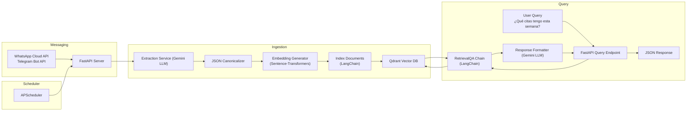

# appointment-rag

This repository is an implementation of a RAG with a WhatsApp / Telegram integration to save appointments and keep the user informed about their meetings.

## Architecture

Below is the Mermaid diagram illustrating the architecture of the solution:



## Getting Started

1. **Clone the repository**

   ```bash
   git clone https://github.com/your-org/appointment-rag.git
   cd appointment-rag
   ```

2. **Set up environment variables**
   Create a `.env` file with the following:

   ```dotenv
   WHATSAPP_VERIFY_TOKEN=your_meta_token
   GOOGLE_API_KEY=your_gemini_api_key
   QDRANT_URL=http://localhost:6333
   QDRANT_COLLECTION=citas
   ```

3. **Install dependencies**

   ```bash
   pip install -r requirements.txt
   ```

4. **Run Qdrant**

   ```bash
   docker-compose up -d qdrant
   ```

5. **Start the application**

   ```bash
   uvicorn api.main:app --host 0.0.0.0 --port 8000
   ```

6. **Test the endpoints**

   * POST `/webhook/whatsapp` to ingest messages.
   * GET `/citas/semana` to retrieve appointments for the week.
## Project Structure

```plaintext
project/
├── adapters/                   
│   └── messaging_adapter.py      # Adapter: encapsula WhatsApp/Telegram  
├── domain/                     
│   └── appointment.py            # Entidad de negocio “Appointment”  
├── infrastructure/             
│   ├── qdrant_repository.py      # Repository: acceso a Qdrant (upsert, search)  
│   └── service_factory.py        # Factory: crea LLMs, embeddings y repositorios según config  
├── services/                   
│   ├── ingestion_pipeline.py     # Pipeline de ingestión (Template Method)  
│   └── retrieval_service.py      # Lógica de recuperación y construcción de respuesta  
├── api/                        
│   └── main.py                   # FastAPI: webhooks y endpoints de consulta  
├── utils/                      
│   └── helpers.py                # Funciones auxiliares (UUIDs, parseo de fechas)  
├── tests/                      
│   ├── test_repository.py        # Tests para QdrantRepository  
│   ├── test_messaging_adapter.py # Tests para Adapter  
│   └── test_services.py          # Tests para servicios  
├── .env                          # Credenciales y configuración  
├── requirements.txt              # Dependencias pip  
├── Dockerfile                    # Imagen de la app  
├── docker-compose.yml            # Arranque de app + Qdrant  
└── README.md                     # Documentación de inicio rápido
```
